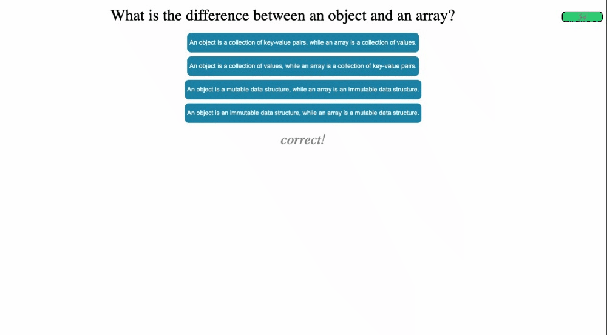

# Online-Coding-Quiz

## Description

The purpose of this assignment was to create an online, 4 question multiple-choice coding quiz in JS. Upon pressing 'start', a 75 second timer begins and you are presented with the first question. As you answer each question, you are informed whether you got it correct or not and pushed to the next question. Upon quiz completion or the timer running out, you are brought to an end game screen where you can save your score with your initials.

## Installation

Project is live at https://mattchiaro.github.io/online-coding-quiz/

## Usage

Press 'Start the Quiz!"

